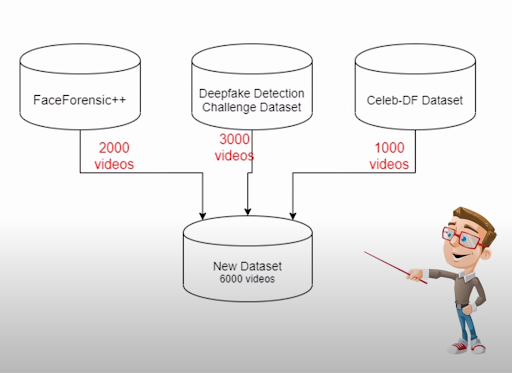
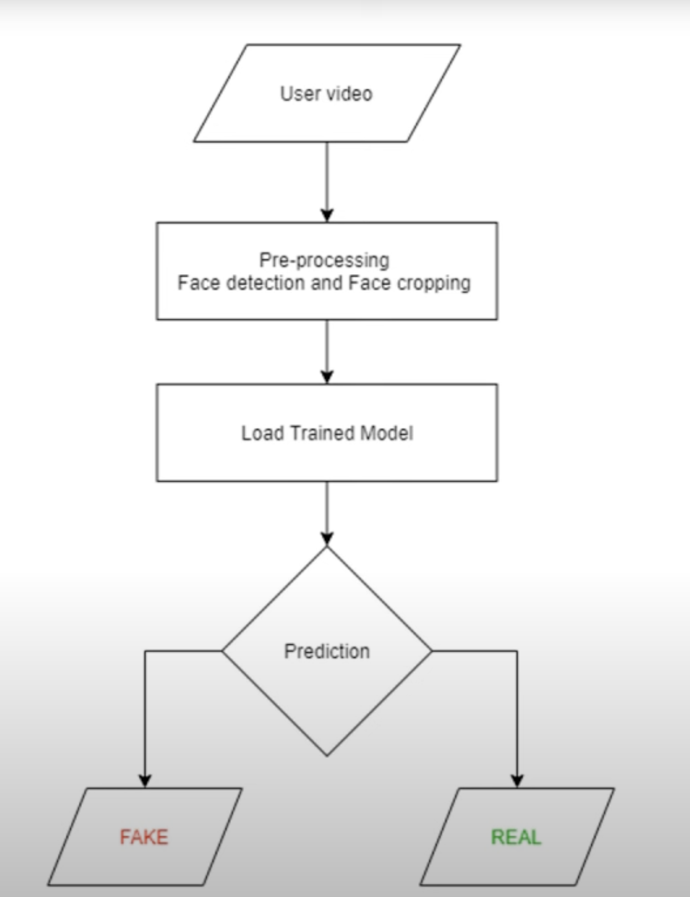

# deepfakeDetectionSystem

Detect AI-generated videos using CNN (ResNeXt) and LSTM models.

---

## 1. Introduction
Deepfakes are synthetic media where a person’s likeness is replaced or manipulated using deep learning. While this technology can be applied creatively, it also poses risks such as spreading misinformation, fraud, and identity theft.  
This project builds a **deepfake detection pipeline** capable of distinguishing between real and fake videos using advanced machine learning models.

---

## 2. Motivation
With social media and digital content exploding, identifying real versus manipulated content is crucial. The motivation for this system is:  
- To **increase trust** in digital platforms.  
- To **combat misinformation** spread via deepfake videos.  
- To provide a **scalable, automated solution** that processes video efficiently.  

---

## 3. System Architecture
The system architecture follows two main flows:  
- **Training flow**: preprocessing dataset, feature extraction (ResNeXt), sequence learning (LSTM), evaluation.  
- **Prediction flow**: uploading new video, preprocessing, and classifying as *REAL* or *FAKE*.  

---

## 4. Dataset (50% Split)
We combined multiple benchmark datasets to build a balanced dataset of **6,000 videos**:  
- **FaceForensic++**: 2,000 videos  
- **Deepfake Detection Challenge (DFDC)**: 3,000 videos  
- **Celeb-DF**: 1,000 videos  

50% are real and 50% are fake, ensuring fair training and testing.  

---

## 5. Data Preprocessing
Preprocessing ensures the system focuses only on facial regions. Steps include:  
1. Splitting video into frames  
2. Face detection  
3. Cropping faces  
4. Creating face-only video sequences  
5. Saving face-cropped videos  

---

## 6. Feature Extraction and LSTM Classification
- **ResNeXt CNN** extracts features from individual frames.  
- **LSTM** processes the temporal sequence of frames.  
- Final classification: *REAL* or *FAKE*.  

---

## 7. Training Process
Training steps:  
1. Merge datasets → 6,000 videos  
2. Preprocess (face detection and cropping)  
3. Split into 4,200 training and 1,800 testing videos  
4. Extract features with **ResNeXt**  
5. Classify sequences with **LSTM**  
6. Evaluate with confusion matrix and accuracy  
7. Export trained model  

---

## 8. Expected Performance
The model leverages both spatial and temporal analysis:  
- **ResNeXt CNN** captures frame-level features.  
- **LSTM** learns temporal consistency across frames.  
- Evaluated with confusion matrix and accuracy metrics.  

Expected outcomes:  
- High detection accuracy  
- Generalization across multiple datasets  
- Ready-to-use exported model for real-world predictions  

---

